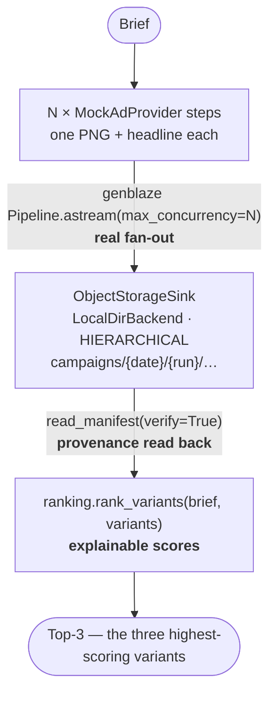

<div align="center">
  
  <h1>🎯 Salvo</h1>
  <p><em>Brief in → scored ad variants out — best three ship</em></p>
  

  <br/>

  [](https://salvo.edycu.dev)
  [](https://api.salvo.edycu.dev/console)
  [](https://api.salvo.edycu.dev/docs)
  [](https://salvo.edycu.dev/pitch.html)
  [](https://youtu.be/your-video)
  [](https://backblaze-generative-media.devpost.com)

  <br/>

  
  
  
  

</div>

**Brief in → N scored ad variants out → best three ship.** Salvo is a batch creative
factory built on **[Genblaze](https://pypi.org/project/genblaze/) + Backblaze B2**:
give it a creative brief, it fans out `N` ad-image variants through one real Genblaze
`Pipeline`, stores every variant (with provenance) through a B2 object sink, scores them
with an **explainable, deterministic** ranking, and surfaces the top 3 to ship.

## ⚙️ How it works



Every variant is scored on three transparent signals, and each score ships with a
plain-English breakdown of exactly how it was reached:

| Signal | Weight | What it measures |
|---|---|---|
| **Brief coverage** | 0.45 | how many of the brief's keywords the headline actually uses |
| **Headline length** | 0.25 | closeness to a 22–42 character scannable sweet spot |
| **Engagement index** | 0.30 | a deterministic pseudo-signal *seeded from the content hash* |

> **Honesty note.** The engagement index is **not** real click/CTR data — it is a
> deterministic stand-in seeded from the content hash so the ranking is reproducible
> offline, and every reason string says so. No fabricated metrics are presented as real.

## 🟢 OFFLINE mode (the always-green demo path)

Salvo runs with **zero credentials** by default. `OFFLINE=1` (the default) uses a mock
image provider that emits real PNG bytes (via a dependency-free raw-PNG encoder — no
Pillow, no ffmpeg) and an on-disk `LocalDirBackend` that implements Genblaze's documented
`StorageBackend` interface. The full pipeline — fan-out, storage, manifest verification,
ranking — exercises real Genblaze code paths without touching the network.

Setting `B2_KEY_ID` / `B2_APP_KEY` switches storage to a real Backblaze B2 bucket via
Genblaze's `S3StorageBackend`; the app auto-detects credentials at startup.

## 🚀 Quickstart

```bash
uv sync --extra dev
OFFLINE=1 .venv/bin/python -m pytest  # 19 tests, all green
OFFLINE=1 .venv/bin/python -m uvicorn app.main:app --port 8000
```

Then open **http://localhost:8000/console** — type a brief, hit *Generate*, and watch the
scored variant grid render with the top 3 highlighted.

### API

| Method | Path | Purpose |
|---|---|---|
| `GET` | `/healthz` | liveness + mode + genblaze version |
| `POST` | `/campaigns` | `{ "brief": "...", "n": 6 }` → variants + ranking + top-3 |
| `GET` | `/campaigns/{id}` | fetch a completed campaign |
| `GET` | `/campaigns/{id}/variants/{i}.png` | a variant's PNG bytes |
| `GET` | `/console` | the operator console |

```bash
curl -X POST localhost:8000/campaigns \
  -H 'content-type: application/json' \
  -d '{"brief":"eco water bottle for hikers","n":6}'
```

## ✅ Tests

19 pytest tests (`OFFLINE=1 .venv/bin/python -m pytest`) covering: the campaign runs
offline end-to-end, the ranking is deterministic + explainable, the top-3 are the three
highest scorers, manifest provenance verifies, stored variant PNGs are valid, and the
FastAPI surface (health, create/fetch, PNG serving).

## 🚢 Deploy

Dockerized for Railway (`Dockerfile` + `railway.json`, healthcheck `/healthz`, binds
`0.0.0.0:$PORT`). The image installs dev dependencies on purpose — Genblaze's OFFLINE mock
engine imports `pytest` at module load, so it is a runtime dependency of the demo path.

## 📄 License

MIT — see [LICENSE](LICENSE).
